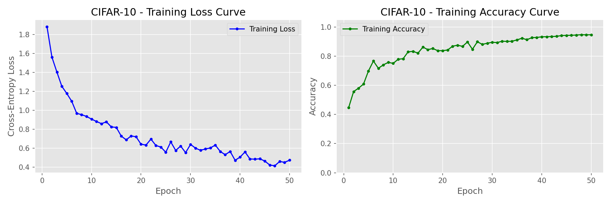
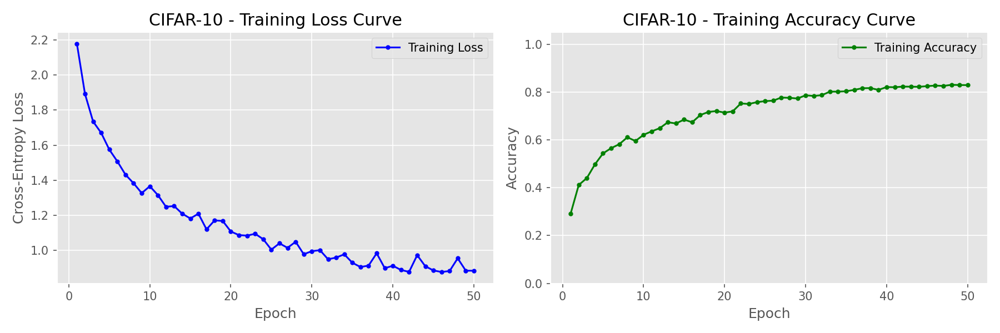

# ECS 170 Spring 2026 - Stage 3 Report (Completed Draft)

## Team Information
- Team Name: [Enter Team Name]
- Student 1: [Name] | [ID] | [Email]
- Student 2: [Name] | [ID] | [Email]
- Student 3: [Name] | [ID] | [Email]
- Student 4: [Name] | [ID] | [Email]
- Student 5: [Name] | [ID] | [Email]

---

## Section 1: Task Description
This project studies supervised image classification using convolutional neural networks (CNNs). The objective is to train and evaluate deep learning models on three datasets with different characteristics:
- MNIST: grayscale handwritten digit recognition (10 classes).
- ORL: grayscale face identity recognition (40 classes).
- CIFAR-10: color natural image object recognition (10 classes).

The goal is to design suitable CNN architectures, train with gradient-based optimization, evaluate using Accuracy/Precision/Recall/F1 metrics, and analyze the effect of key hyperparameters through ablation studies.

---

## Section 2: Model Description
Three CNN-based models were used, with dataset-specific designs:

### 2.1 MNIST Model
A compact 2-convolution CNN:
- Conv(1->32, 3x3) + BN + ReLU + MaxPool
- Conv(32->64, 3x3) + BN + ReLU + MaxPool
- Dropout2d
- FC(3136->128) + ReLU + Dropout
- FC(128->10)

Reasoning: MNIST is relatively simple, so a shallow model is enough and avoids over-parameterization.

### 2.2 ORL Model
A deeper grayscale face classifier:
- Three convolutional blocks with BN/ReLU/Pooling
- FC(19712->512)
- FC(512->40)

Reasoning: Face identity classification has higher intra-class variation than MNIST, requiring stronger feature extraction capacity.

### 2.3 CIFAR-10 Model
ResNet-18 adapted for 32x32 images:
- Stem: Conv(3->64, 3x3, stride 1) + BN + ReLU (no maxpool)
- Residual stages: [64, 128, 256, 512] with BasicBlocks and downsampling by stride 2
- AdaptiveAvgPool + Dropout + FC(512->10)

Enhancements used in final CIFAR training:
- MixUp augmentation
- SGD + momentum + Nesterov
- OneCycleLR schedule
- Label smoothing

Reasoning: CIFAR-10 is harder and benefits from residual learning and stronger regularization.

---

## Section 3: Experiment Settings

### 3.1 Dataset Description
- MNIST:
  - Size: 60,000 train / 10,000 test
  - Format: 28x28 grayscale
  - Classes: 10
- ORL:
  - Size: 360 train / 40 test
  - Format: 112x92 grayscale (single-channel)
  - Classes: 40
- CIFAR-10:
  - Size: 50,000 train / 10,000 test
  - Format: 32x32 RGB
  - Classes: 10

Partitioning was performed according to the provided dataset train/test splits.

### 3.2 Detailed Experimental Setups

#### Common setup
- Framework: PyTorch
- Metrics: Accuracy, Precision (macro/weighted), Recall (macro/weighted), F1 (macro/weighted/micro)

#### MNIST setup
- Optimizer: Adam
- LR schedule: StepLR(step=5, gamma=0.5)
- Epochs: 10
- Default LR: 1e-3
- Batch size: 256 (in experiment runner)
- Variants:
  - default: dropout=0.25
  - high_dropout: dropout=0.5
  - low_lr: lr=3e-4

#### ORL setup
- Optimizer: Adam
- LR schedule: StepLR(step=10, gamma=0.5)
- Default epochs: 30
- Default LR: 1e-3
- Batch size: 16
- Variants:
  - default (30 epochs)
  - more_epochs (50 epochs)
  - high_lr (lr=5e-3)
  - high_dropout (dropout=0.5)

#### CIFAR-10 setup (final Colab run)
- Model: ResNet-18 (CIFAR-adapted)
- Optimizer: SGD(momentum=0.9, nesterov=True, weight_decay=5e-4)
- LR schedule: OneCycleLR(max_lr as configured, pct_start=0.1, cosine annealing)
- Loss: CrossEntropy with label smoothing=0.1
- Epochs: 50
- Batch size: 256
- Augmentation: RandomCrop(32,padding=4), RandomHorizontalFlip, ColorJitter, Normalize, RandomErasing
- Additional regularization: MixUp (alpha=0.2)
- Variants:
  - default: lr=0.1, dropout=0.0
  - high_dropout: lr=0.1, dropout=0.3
  - low_lr: lr=0.01, dropout=0.0

### 3.3 Evaluation Metrics
For multiclass classification:
- Accuracy: proportion of correct predictions.
- Precision: fraction of predicted positives that are correct.
- Recall: fraction of true positives recovered.
- F1 score: harmonic mean of precision and recall.

Macro averages treat all classes equally, while weighted averages account for class frequency.

### 3.4 Source Code
- Code path used in this project: /Users/kavosh/Desktop/stage3/code
- Public link: [Add GitHub or shared drive link here]

### 3.5 Training Convergence Plot
Representative convergence plots are included below (one per dataset):

MNIST (default):

ORL (default):

CIFAR-10 (default):

CIFAR-10 (low-lr ablation):

Additional ablation convergence plots are included in `assets/plots/`.

All runs show decreasing loss and improving test accuracy over epochs. The CIFAR low-lr ablation converges more slowly and reaches a lower plateau, consistent with underfitting.

### 3.6 Model Performance

#### MNIST performance
| Config | Accuracy | Precision (Macro) | Recall (Macro) | F1 (Macro) |
|---|---:|---:|---:|---:|
| default | 0.9928 | 0.9927 | 0.9927 | 0.9927 |
| high_dropout | 0.9918 | 0.9918 | 0.9917 | 0.9917 |
| low_lr | 0.9904 | 0.9903 | 0.9903 | 0.9903 |

#### ORL performance
| Config | Accuracy | Precision (Macro) | Recall (Macro) | F1 (Macro) |
|---|---:|---:|---:|---:|
| default | 1.0000 | 1.0000 | 1.0000 | 1.0000 |
| more_epochs | 1.0000 | 1.0000 | 1.0000 | 1.0000 |
| high_lr | 0.9000 | 0.8500 | 0.9000 | 0.8667 |
| high_dropout | 0.9750 | 0.9625 | 0.9750 | 0.9667 |

#### CIFAR-10 performance (uploaded final run)
| Config | Final Accuracy | Best Accuracy (Epoch) | Precision (Macro) | Recall (Macro) | F1 (Macro) | Train Time |
|---|---:|---:|---:|---:|---:|---:|
| default | 0.9462 | 0.9466 (48) | 0.9463 | 0.9462 | 0.9462 | 41.2 min |
| high_dropout | 0.9456 | 0.9470 (49) | 0.9459 | 0.9456 | 0.9457 | 40.9 min |
| low_lr | 0.8288 | 0.8300 (48) | 0.8275 | 0.8288 | 0.8278 | 41.0 min |

### 3.7 Ablation Studies

#### MNIST ablation
- Increasing dropout from 0.25 to 0.5 caused a small accuracy decrease (0.9928 -> 0.9918).
- Lower LR (3e-4) also slightly reduced performance (0.9904), likely due to slower convergence in only 10 epochs.

#### ORL ablation
- More epochs (50 vs 30) did not improve beyond perfect score (both 1.0000).
- High LR (5e-3) significantly hurt macro-F1 (0.8667), indicating unstable optimization.
- High dropout reduced performance compared to default but remained strong (0.9750 accuracy).

#### CIFAR-10 ablation
- default and high_dropout performed similarly in final accuracy (~94.6%), indicating regularization robustness.
- low_lr (0.01) underfit heavily (~82.9%), showing that this model/schedule needs sufficiently high peak LR.
- Best epoch and final epoch were very close for default/high_dropout, indicating stable late-stage convergence without strong overfitting collapse.

---

## Short Conclusion
The project demonstrates that model capacity and optimization strategy must match dataset complexity. A shallow CNN is sufficient for MNIST, a medium-depth CNN is effective for ORL, and a residual architecture with strong augmentation/scheduling is necessary for CIFAR-10. The strongest CIFAR setting achieved 94.62% final accuracy and 94.66% best accuracy.
